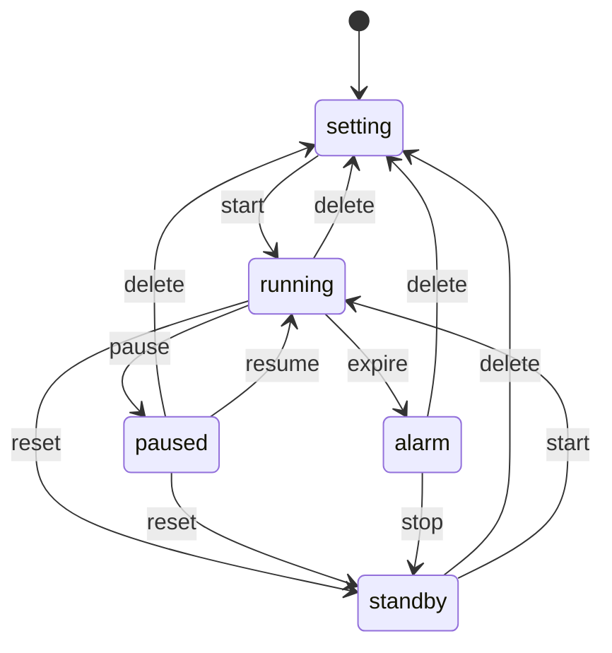

# state-shifter(s)

## About

### JavaScript Finite State Machines that are simple to use to simplify your code, while powerful and flexible

[Finite State Machines](https://eng.libretexts.org/Under_Construction/Book:_Discrete_Structures/09:_Finite-State_Automata/9.01:_Introduction/9.1.01:_Finite-State_Machine_Overview) (FSM) helps organize your code and prevent errors by preventing a complex web of `if else / switch` statements.  If you picture your code as a flowchart with several branches, then a FSM is for you.

state-shifter seeks to make FSMs easy to learn, fun to build, while maximizing JavaScript's power and flexibility.  It is not a full DSL and ecosystem like [XState](https://stately.ai/).  Rather it is only there to progress though the state (& run the functions) you define.  state-shifter code is very minimal, with only a few conventions to remember.


## Example

Is your code messy JavaScript/Typescript code full of `if/else/switch/case` statements?
with state-shifter, you can reduce the complex down to an easy to scan object that is traversed by a short script.  Here we take 65 lines web of JS reduced to 25 lines thanks to `simple-state-shifter`.

The simple-state-shifter FSM is a short <i>clean object</i> while the same result in plain JavaScript requires many statements!  FSMs can help with development and debugging speed.  See for yourself!


[(theme: tawny-owl)](https://github.com/tomByrer/tawny-owl-theme)

### try out the [live demo where you can press buttons to send triggers / events](https://tombyrer.github.io/state-shifter/demos.html)

<details>
<summary>Click to open for more detail of this example:</summary>
A client wants you to build a 'countdown timer' (sometimes found as Pomodoro timer).  He wants it to have the following modes:  

- setting (enter timer length)
- running (time is counting down)
- paused (temporary pause)
- alarm (time expired)
- standby (timer is reset to start)

Not all of these modes are to be accessible to each other; only a few triggers will transition to another mode (AKA 'state').  So you produce this [lovely MermaidJS diagram](https://www.mermaidchart.com/play#pako:eNp9UDFuwzAM_ArhsYA-wCFTxk5Z6wysxdhCbcqQaCRB0L_Hoh3AaOBOIu94dyIfVRM9V1g552ppolxCi7UAaMcDI1xi4qwF6GP8QehI_DHRVQyie5wUwVObuBazyErKxzAjNJQZHxI3GqLA56n0Xx9ncO4AmVWDtAVaS4PTJFJqhNkoWfAL2qjQc8_Kf1nqKQ3ItzGkN26kKbNHe95cdd7q-47zqmyRy_BO4pb8R7gGFG4aTGjf2zHdcKtn1jjadZZ-R7dlX4nr5arfJxGwpRE):




The above diagram translates to this code:
```js
import createMachine from '../simple-state-shifter'
const states ={
 setting: { // default 1st screen, no timer set
  start: 'running',
  },
 running: {
  delete: 'setting',
  expire: 'alarm', // countdown reached 0
  pause: 'paused', // halt countdown, current value is on hold
  reset: 'standby', // stop countdown, return to after the time is set
  },
 paused: {
  delete: 'setting',
  reset: 'standby',
  resume: 'running',
  },
 alarm: {
  delete: 'setting',
  reset: 'standby', // AKA 'stop the alarm'
  },
 standby: { // timer reset, awaiting to start
  delete: 'setting',
  start: 'running',
  },
}
export const machine = createMachine(states)
```

Note, this is non-functioning 'timer'.  To get it to work, you have to change each target into a function that you run, and `return` the next state, like this:
```js
export const states ={
  setting: {  // 1st screen, no timer set
    start: (sec)=>{
      sec ||= data.get('defaultSeconds')
      if (sec > 0){
        FN.start(sec)
        return 'running'
      }},
  },
  running: {
    delete: ()=>{FN.pause();FN.delete();return 'setting'},
    expire: ()=>{FN.pause();return 'alarm'}, // countdown reached 0
    pause: ()=>{FN.pause();return 'paused'}, // stop countdown, current value is on hold
    reset: ()=>{FN.pause();FN.reset();return 'standby'}, // stop countdown, return to after the time is set
  },
  paused: {
    delete: ()=>{FN.delete();return 'setting'},
    reset: ()=>{FN.reset();return 'standby'},
    resume: ()=>{FN.resume();return 'running'},
  },
  alarm: {
    delete: ()=>{FN.delete();return 'setting'},
    reset: ()=>{FN.reset();return 'standby'},// note pause = stop
  },
  standby: { // timer reset, awaiting to start
    delete: ()=>{FN.delete();return 'setting'},
    start: ()=>{FN.start();return 'running'},
  },
}
```
</details>


## Usage

### `createMachine` function parameters:

* definition [manditory]: object of states & triggers
  * the target of triggers may be the next state or a function that returns the next state if applicable
* data [optional]: where 'state' and 'context' are held.  Default: `new Map([['state','']])`
* stateID [optional]: key name in `data` that holds the FSM current state.  Default: `state`

### Methods:

* `machine.trigger`: AKA _event_: pass the string to trigger a transition or function call
* `machine.getState` : returns current _state_ (position) of the Finite State Machine
* `machine.getTriggers`: returns an array of triggers you can use to change the current state or to activate functions

### Conventions

* instantiated FSM is named 'machine' : `export const machine = createMachine(states)`
* if you use an external data source, the FSM current state key is named `state`
* Each state is a key within `states={}`.  Each sub-objects have transitions (AKA triggers) listed as keys, with their values are the destination states.  Easy for everyone to read!
* states are usually nouns, triggers are usually verbs or commands like 'next'
* *guard conditions* : replace the value of the trigger with a function. 

### Advanced

#### Bring another state-storage
* Default: internal js Map() with a key of `state`
  - `get` and `set` are used internally to change the state
  - value is returned as `data` for the returned machine
* you may override the state-storage by passing it as a second parameter
  - your state-storage must have methods for `get(keyname)` and `set(keyname, value)`
  - declare your base state & context names & defaults in the `presets=[ [key, value],... ]` array
  - by convention / default, the base state for the FSM has a key name of `state`
    - if you want to use a different key name for the base state, pass it as a third parameter
* be aware external state-storage data can be accessed for read & write outside of the FSM:
  - pros (ease of use)
  - cons (changes outside of FSM)
* successful third-party Map replacement libraries used:
  - [tomByrer/alien-signals-mapish](https://github.com/tomByrer/alien-signals-mapish) to automatically update the 
   [countdown timer](https://github.com/tomByrer/state-shifter/blob/main/packages/simple-state-shifter/demos//countdown-timer/02-countdown-timer.full)
  - [online demo](https://tombyrer.github.io/state-shifter/demos.html) uses another ReactJS wrapper for [alien-signals](https://github.com/stackblitz/alien-signals) to add reactivity.

#### Edit the states object

* When you edit the states object that you fed to create the FSM (eg `let machine = createMachine(states, data)`), any changes you made will not happen unless you restart the FSM.

## TODO

- [ ] signaling-state-shifter docs
- [ ] test vs XState
  - [ ] speed & memory in browser, bun, node
  - [ ] AI tokens
- [ ] Mermaid.js to state
- [ ] deluxe-state-shifter (nested children/parallel)

## License

 (C)2025-2026 Tom Byrer, rights reserved, but ask me about OSS / usage License
