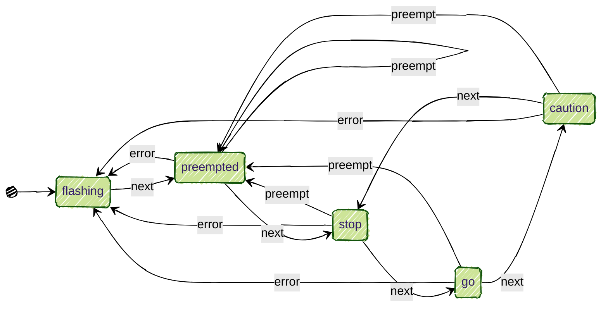

# state-shifter(s)

## About

### JavaScript Finite State Machines that are simple to use to simplify your code, while powerful and flexible

[Finite State Machines](https://eng.libretexts.org/Under_Construction/Book:_Discrete_Structures/09:_Finite-State_Automata/9.01:_Introduction/9.1.01:_Finite-State_Machine_Overview) (FSM) helps organize your code and prevent errors by preventing a complex web of `if else / switch` statements.  If you picture your code as a flowchart with several branches, then a FSM is for you.

state-shifter seeks to make FSMs easy to learn, fun to build, while maximizing JavaScript's power and flexibility.  It is not a full DSL and ecosystem like [XState](https://stately.ai/).  Rather it is only there to progress though the state (& run the functions) you define.  state-shifter code is very minimal, with only a few conventions to remember.


## Example

<thead>
<tr>
<th>plain js</th>
<th>state-shifter</th>
</tr>
</thead>
<tbody>
<tr>
<td>
```js
switch (data.get('state')) {

  case 'setting':
    if (event === 'start') {
      data.set('state', 'running')
    }
    break;

  case 'running':
    if (event === 'delete') {
      data.set('state', 'setting')
    } else if (event === 'expire') {
      data.set('state', 'alarm')
    } else if (event === 'pause') {
      data.set('state', 'paused')
    } else if (event === 'reset') {
      data.set('state', 'standby')
    }
    break;

  case 'paused':
    if (event === 'delete') {
      data.set('state', 'setting')
    } else if (event === 'pause') {
      data.set('state', 'paused') // Remain in paused state
    } else if (event === 'resume') {
      data.set('state', 'running')
    }
    break;

  case 'alarm':
    if (event === 'delete') {
      data.set('state', 'setting')
    } else if (event === 'stop') {
      data.set('state', 'standby')
    }
    break;

  case 'standby':
    if (event === 'delete') {
      data.set('state', 'setting')
    } else if (event === 'start') {
      data.set('state', 'running')
    }
    break;

  default:
    data.set('state', 'setting')
    break;
}
```
</td>
<td>
```js
const states ={
  _: {
    id: 'countdown-timer',
  },
  idle: {  // 1st screen, no timer set
    set: 'setting',
  },
  setting: { // entering time value
    delete: 'idle',
    start: 'running', // completed  setting timer time
  },
  running: {
    delete: 'idle',
    expire: 'alarm', // countdown reached 0
    pause: 'paused', // stop countdown, current value is on hold
    reset: 'standby', // stop countdown, return to after the time is set
  },
  paused: {
    delete: 'idle',
    reset: 'standby',
    resume: 'running',
  },
  alarm: {
    delete: 'idle',
    stop: 'standby',
  },
  standby: { // timer reset, awaiting to start
    delete: 'idle',
    start: 'running',
  },
}
```
</td>
</tr>
</tbody>
</table>


```js
switch (data.get('state')) {

  case 'setting':
    if (event === 'start') {
      data.set('state', 'running')
    }
    break;

  case 'running':
    if (event === 'delete') {
      data.set('state', 'setting')
    } else if (event === 'expire') {
      data.set('state', 'alarm')
    } else if (event === 'pause') {
      data.set('state', 'paused')
    } else if (event === 'reset') {
      data.set('state', 'standby')
    }
    break;

  case 'paused':
    if (event === 'delete') {
      data.set('state', 'setting')
    } else if (event === 'pause') {
      data.set('state', 'paused') // Remain in paused state
    } else if (event === 'resume') {
      data.set('state', 'running')
    }
    break;

  case 'alarm':
    if (event === 'delete') {
      data.set('state', 'setting')
    } else if (event === 'stop') {
      data.set('state', 'standby')
    }
    break;

  case 'standby':
    if (event === 'delete') {
      data.set('state', 'setting')
    } else if (event === 'start') {
      data.set('state', 'running')
    }
    break;

  default:
    data.set('state', 'setting')
    break;
}
```

```js
const states ={
  _: {
    id: 'countdown-timer',
  },
  idle: {  // 1st screen, no timer set
    set: 'setting',
  },
  setting: { // entering time value
    delete: 'idle',
    start: 'running', // completed  setting timer time
  },
  running: {
    delete: 'idle',
    expire: 'alarm', // countdown reached 0
    pause: 'paused', // stop countdown, current value is on hold
    reset: 'standby', // stop countdown, return to after the time is set
  },
  paused: {
    delete: 'idle',
    reset: 'standby',
    resume: 'running',
  },
  alarm: {
    delete: 'idle',
    stop: 'standby',
  },
  standby: { // timer reset, awaiting to start
    delete: 'idle',
    start: 'running',
  },
}
```

The FSM is a very <i>simple object<i>.  Each state is a key within `states={}`.  Each sub-objects have transitions (AKA triggers) listed as keys, with their values are the destination states.  Easy for everyone to read!  There are some conventions:
- you bring your own state-storage, be it a simple JS `Map()`, `useState()` hook from React, 'alien-signals` ({example}(https://github.com/tomByrer/state-shifter/blob/main/packages/simple-state-shifter/demos/02-firepit-timers.js#L7-L26)), whatever!
  - declare your base state & context names & defaults in the `presets=[ [key, value]]` array
- in `states={}`:
  - first `_` state is NOT a 'state', but a configuration object.
    - `id` is used by state-shifter to define the state-storage
  - second key is the 'inital' state 

### Advanced with functions

```js
import createMachine from '../simple-state-shifter'

export const presets = [
  ['firepit-state', ''], // <- base state
  // 'context' is defined below
  ['fire pile', 0],
]
export const data = new Map(presets)


/* functions for states */
function fuel(){
  data.set('fire pile', data.get('fire pile') + 1)
  console.log('🪵 fire pile is now', data.get('fire pile'), 'high')
}


export const states ={
  _: { // 1st 'state' is configuration
    id: 'firepit',
  },
  // 2nd state is inital / default '1st state'
  empty: {
    fuel: ()=>{
      fuel()
      return 'standby' // return a new state if you want
    },
  standby: {
    empty: ()=>{
      data.set('fire pile', 0)
      return 'empty'
    },
    fuel: ()=>{ fuel() }, // if you do not want to change states, don't return
    ignite: 'burning',
  },
  burning: {
    _: {
      fnEnter: ()=>{ console.log('🔥 fire burns') }, // AKI onEnter
    },
    extinguish: 'smoldering',
    fuel: ()=>{ fuel() }, 
  },
  smoldering: { // simulate embers still burning
    cover: 'empty',
    fuel:()=>{
      fuel()
      console.log('✨ embers respark the fire')
      return 'burning'
    },
    water: 'wet',
  },
  wet: {
    dry: 'empty',
  },
}
```


## Usage

```bash
bun i
bun run run-demos.js
```

```js


## Licence

 (C)2025 Tom Byrer, rights reserved, but ask me about OSS / usage License


